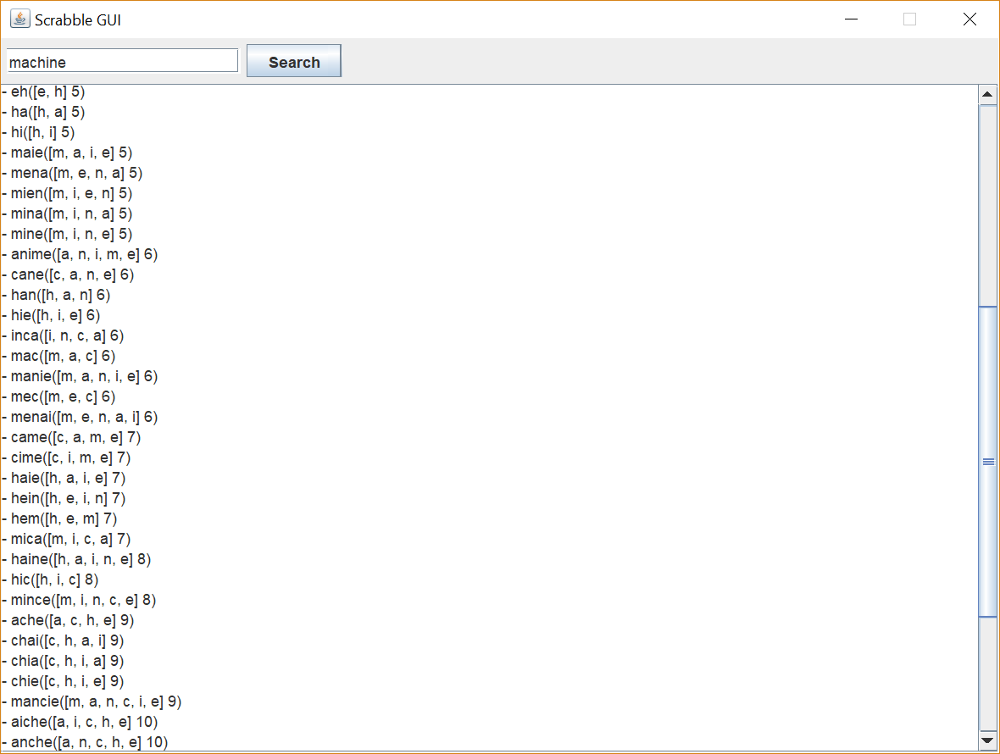

# Scrabble calculator & matching words
---
## Authors: Raphael Dray.
---
> This program calculate and find the matching words with your letter sequence.
> It can be opened in **terminal** or in a window using the ScrabbleGUI class.

> It's written in __Java language__.

---
### Main View:

